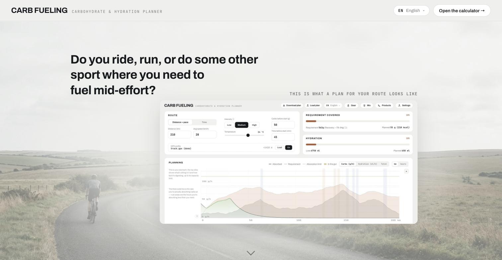
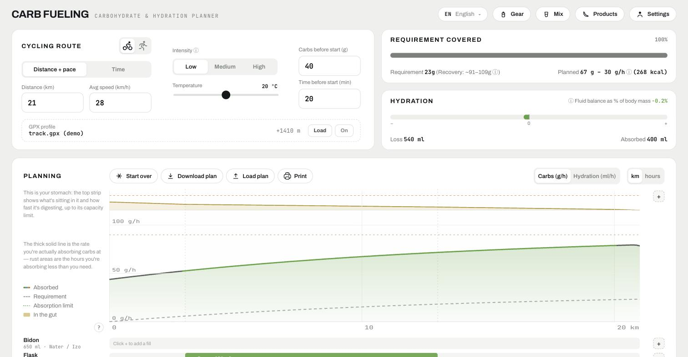

# Carb Fueling

A carb and hydration planner for long rides and runs. You describe your route (distance + pace, or duration), your conditions (weight, effort, temperature), configure your bottles/flasks, and lay out **fills** (what you drink and over which stretch) and **food/extras** along the route. The app computes carb supply vs. demand over time (g/h), hydration coverage, and how much of the mix to measure into each bottle.

Free, open source, no account, no server, no tracking.

Live app: https://carbfueling.com

<p>
  
  
</p>

## Stack

- Vite + React + TypeScript
- State: local store, persisted to `localStorage` (no backend)
- Charts: hand-rolled SVG (no charting library)
- Deployed to GitHub Pages via GitHub Actions

## Development

```bash
npm install
npm run dev       # local dev server
npm test          # vitest
npx tsc -b        # typecheck
npm run build     # production build into dist/
```

## Project layout

See `MAP.md` for an index of what lives where.

## License

[MIT](LICENSE)
